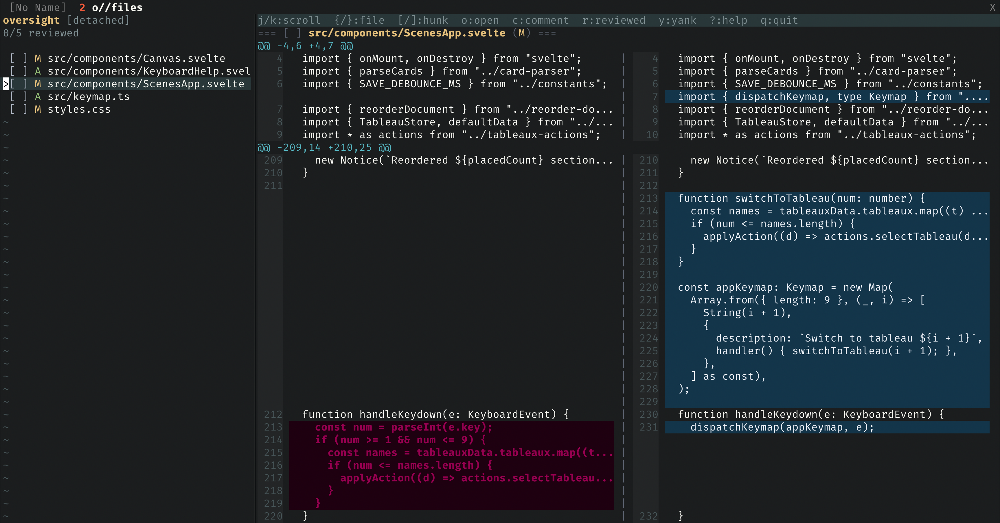

# oversight.nvim

A Neovim plugin for reviewing AI-generated code changes. Provides a focused,
terminal-based interface for examining uncommitted changes, adding contextual
comments, and generating review summaries that can be fed back to AI agents.

Supports both **Git** and **Jujutsu (jj)** version control systems with
automatic detection.

Rather than a full VCS UI, oversight.nvim is a specialized tool for the code
review workflow - particularly useful when you've asked an AI to generate code
and want to review the changes before committing.



## Features

- **Side-by-side diff view** - Display old and new code versions for easy comparison
- **Dual-panel layout** - File list on the left, diff view on the right
- **Line-level comments** - Add detailed feedback on specific lines of changes
- **File-level comments** - Add general feedback about entire files
- **4 comment types** - Note, Suggestion, Issue, and Praise with distinct colors
- **File review status** - Mark files as reviewed (visually folded when complete)
- **Session persistence** - Comments and review state survive editor restarts
- **Export to markdown** - Generate formatted feedback summaries for AI agents
- **Multi-VCS support** - Works with Git and Jujutsu (jj) repositories

## Credits

This plugin is a Neovim port of [tuicr](https://github.com/agavra/tuicr) by
Almog Gavra. The original is an excellent standalone TUI application written in
Rust - check it out if you prefer a standalone tool over a Neovim plugin.

## Installation

**Requirements:**

- Neovim >= 0.10.0
- **git** or **jj (Jujutsu)** - at least one must be in PATH
- [plenary.nvim](https://github.com/nvim-lua/plenary.nvim)

### lazy.nvim

```lua
{
    "krisajenkins/oversight.nvim",
    dependencies = { "nvim-lua/plenary.nvim" },
    config = function()
        require("oversight").setup()
    end,
}
```

### packer.nvim

```lua
use {
    "krisajenkins/oversight.nvim",
    requires = { "nvim-lua/plenary.nvim" },
    config = function()
        require("oversight").setup()
    end,
}
```

Verify your setup with `:checkhealth oversight`

## Usage

Open the review interface with:

```vim
:Oversight
```

### Workflow

1. Have an AI generate code changes in your repository
2. Run `:Oversight` to open the review interface
3. Navigate through files and review the diffs
4. Add comments with `c` (line-level) or `C` (file-level)
5. Mark files as reviewed with `r`
6. Press `y` to copy your feedback as markdown
7. Paste the feedback back to your AI agent

### Keybindings

| Key                 | Action                                     |
| ------------------- | ------------------------------------------ |
| `j` / `k`           | Scroll up/down                             |
| `Ctrl-d` / `Ctrl-u` | Half page down/up                          |
| `Ctrl-f` / `Ctrl-b` | Full page down/up (diff view)              |
| `{` / `}`           | Previous/next file                         |
| `[` / `]`           | Previous/next hunk                         |
| `g` / `G`           | First/last file                            |
| `Tab`               | Switch between file list and diff panels   |
| `Enter`             | Select file (in file list)                 |
| `o`                 | Open file in new tab for editing           |
| `r`                 | Toggle file as reviewed                    |
| `c`                 | Add/edit comment (edits if on comment)     |
| `C`                 | Add file-level comment                     |
| `dd`                | Delete comment under cursor                |
| `y`                 | Copy all comments to clipboard as markdown |
| `X`                 | Clear all comments                         |
| `R`                 | Refresh (re-fetch changes from VCS)        |
| `?`                 | Show help                                  |
| `q`                 | Quit review                                |

### Comment Input

When adding a comment:

| Key                     | Action                             |
| ----------------------- | ---------------------------------- |
| `Ctrl-s` / `Ctrl-Enter` | Submit comment                     |
| `Esc`                   | Save comment (or discard if empty) |
| `q`                     | Discard comment                    |
| `Ctrl-t` / `Tab`        | Cycle comment type                 |

## License

MIT License - see [LICENSE](LICENSE) for details.
