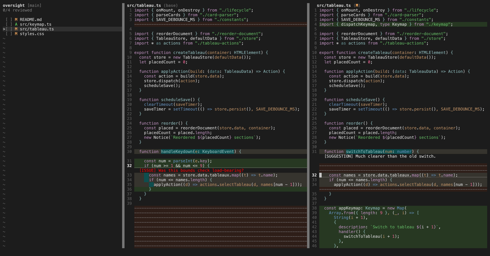

# oversight.nvim

[](https://github.com/krisajenkins/oversight.nvim/actions/workflows/test.yml)

A Neovim plugin for reviewing AI-generated code changes. Provides a focused,
terminal-based interface for examining uncommitted changes, browsing codebases,
adding contextual comments, and generating review summaries that can be fed back
to AI agents.

Supports both **Git** and **Jujutsu (jj)** version control systems with
automatic detection.

Rather than a full VCS UI, oversight.nvim is a specialized tool for the code
review workflow - particularly useful when you've asked an AI to generate code
and want to review the changes before committing. It also supports a browse mode
for leaving notes on any file in the codebase.



<sub>The screenshot is generated, not captured by hand — `nix shell nixpkgs#vhs
-c vhs scripts/demo/screenshot.tape` rebuilds it from a throwaway repository, so
it moves when the plugin does.</sub>

## Features

- **Two modes** - Diff review for uncommitted changes, browse for the full codebase
- **Neovim's own diff** - The file at the base revision and the file now, side by
  side, diffed and highlighted by Neovim itself, with `]c`/`[c`, your `diffopt`
  and your syntax highlighting all working as they do everywhere else
- **Codebase browser** - File tree navigator with treesitter syntax-highlighted file viewer
- **Three-pane review** - File list on the left, the two sides of the diff on the right
- **Line-level comments** - Add detailed feedback on specific lines
- **File-level comments** - Add general feedback about entire files
- **3 comment types** - Suggestion, Issue, and Question with distinct colors
- **File review status** - Mark individual files or entire directories as reviewed
- **Stale-diff detection** - Comments and review status reset when the underlying diff changes
- **Export to markdown** - Generate formatted feedback summaries for AI agents
- **Multi-VCS support** - Works with Git and Jujutsu (jj) repositories
- **Live refresh** - Views update themselves as an agent edits the working tree

## Credits

This plugin is a Neovim port of [tuicr](https://github.com/agavra/tuicr) by
Almog Gavra. The original is an excellent standalone TUI application written in
Rust - check it out if you prefer a standalone tool over a Neovim plugin.

## Installation

**Requirements:**

- Neovim >= 0.9.0
- **git** or **jj (Jujutsu)** - at least one must be in PATH
- [plenary.nvim](https://github.com/nvim-lua/plenary.nvim)

plenary is the only plugin dependency, and `setup()` is required rather than
optional - the `:Oversight` command is created there, so without it nothing is
registered.

### lazy.nvim

```lua
{
    "krisajenkins/oversight.nvim",
    dependencies = { "nvim-lua/plenary.nvim" },
    cmd = "Oversight",
    config = function()
        require("oversight").setup()
    end,
}
```

`cmd = "Oversight"` is optional; it defers loading until you first run the
command.

### vim.pack

Neovim's built-in plugin manager, no third-party manager needed. Requires
Neovim >= 0.12 (the plugin itself still supports 0.9).

```lua
vim.pack.add({
    { src = "https://github.com/nvim-lua/plenary.nvim" },
    { src = "https://github.com/krisajenkins/oversight.nvim" },
})

require("oversight").setup()
```

That tracks the default branch. To follow release tags instead, give the
oversight spec a version range:

```lua
{
    src = "https://github.com/krisajenkins/oversight.nvim",
    version = vim.version.range("*"),
}
```

Verify your setup with `:checkhealth oversight`

### Configuration

`setup()` takes one option:

```lua
require("oversight").setup({
    -- Auto-refresh open views when the repository changes on disk.
    watch = true,
})
```

With `watch` enabled (the default) an open review keeps up with an agent editing
underneath it. Two signals drive it: stat-based pollers on the VCS metadata and
on the files that already have changes give a ~150ms response to editing
something you are already looking at, and a VCS query every two seconds catches
files that only *become* interesting.

The one thing neither notices is a brand-new **untracked** file, because
`git diff HEAD` does not report untracked files at all. Press `R` for that.

Colours are set by overriding the plugin's `Oversight*` highlight groups rather
than through options; see `lua/oversight/highlights.lua` for the list. Review
mode's diff is painted by Neovim's own `DiffAdd`, `DiffChange`, `DiffDelete` and
`DiffText`, which your colorscheme already styles.

Because the diff is Neovim's, `diffopt` is what draws it — and it is yours, so
oversight never writes to it. A good setting:

```lua
vim.opt.diffopt = "internal,filler,closeoff,linematch:60"
```

`internal` selects Neovim's built-in diff library rather than shelling out to
`diff(1)`; `linematch` lines up changed lines within a hunk, which makes small
edits far easier to read. `:checkhealth oversight` warns if `internal` is
missing.

## Usage

### Review Mode

Review uncommitted changes with:

```vim
:Oversight
:Oversight review
```

**Workflow:**

1. Have an AI generate code changes in your repository
2. Run `:Oversight` to open the review interface
3. Navigate through files and review the diffs
4. Add comments with `c` (line-level) or `C` (file-level)
5. Mark files as reviewed with `r`
6. Press `y` to copy your feedback as markdown
7. Paste the feedback back to your AI agent

### Browse Mode

Browse the full codebase and leave notes on any file:

```vim
:Oversight browse
```

**Workflow:**

1. Run `:Oversight browse` to open the file tree
2. Navigate the directory tree (j/k or arrow keys to move, Enter to expand/collapse)
3. Select a file to see its content with syntax highlighting
4. Add comments with `c` (line-level) or `C` (file-level)
5. Mark files or directories as reviewed with `r`
6. Press `y` to copy your notes as markdown

### Review Mode Keybindings

**File List (left panel):**

| Key                 | Action                           |
| ------------------- | -------------------------------- |
| `j` / `k`           | Move up/down                     |
| `Down` / `Up`       | Move up/down                     |
| `Ctrl-d` / `Ctrl-u` | Half page down/up                |
| `g` / `G`           | First/last file                  |
| `Enter`             | Select file (show diff)          |
| `o`                 | Open file in new tab for editing |
| `r`                 | Toggle file as reviewed          |

**Diff View (the two right-hand panels):**

Both sides carry the same keys. The two panes are scrollbound, so plain `j`,
`k`, `Ctrl-d` and the rest move them together.

| Key                 | Action                                        |
| ------------------- | --------------------------------------------- |
| `[` / `]`           | Previous/next hunk (wraps at the ends)        |
| `Ctrl-w h` / `l`    | Move between the base and working-copy panes  |

| `o` / `Enter`       | Open the working copy in a new tab, at this line |
| `c`                 | Comment on this line (edits the one already there) |
| `C`                 | Add file-level comment                        |
| `dd`                | Delete this line's comment                    |
| `r`                 | Toggle file as reviewed                       |

A comment appears as virtual lines under the line it is about, on the side you
wrote it on. Commenting on the left-hand pane records the line number in the
base revision, which the export marks as `Line ~N (deleted)`.

**Across all three windows:**

The three panes are ordinary windows, so `Ctrl-w h` / `Ctrl-w l` move between
them; there is no plugin-specific key for it.

| Key       | Action                                     |
| --------- | ------------------------------------------ |
| `{` / `}` | Previous/next file                         |
| `y`       | Copy all comments to clipboard as markdown |
| `X`       | Clear all comments                         |
| `R`       | Refresh (re-fetch changes from VCS)        |
| `?`       | Show help                                  |
| `q`       | Quit review                                |

### Browse Mode Keybindings

**File Tree (left panel):**

| Key                 | Action                                     |
| ------------------- | ------------------------------------------ |
| `j` / `k`           | Move up/down                               |
| `Down` / `Up`       | Move up/down                               |
| `Ctrl-d` / `Ctrl-u` | Half page down/up                          |
| `g` / `G`           | First/last item                            |
| `Enter`             | Expand/collapse directory, or select file  |
| `l` / `h`           | Expand / collapse directory                |
| `Right` / `Left`    | Expand / collapse directory                |
| `o`                 | Open file in new tab for editing           |
| `r`                 | Toggle reviewed (file or entire directory) |

**File View (right panel):**

| Key                 | Action                                 |
| ------------------- | -------------------------------------- |
| `j` / `k`           | Scroll up/down                         |
| `Down` / `Up`       | Scroll up/down                         |
| `Ctrl-d` / `Ctrl-u` | Half page down/up                      |
| `Ctrl-f` / `Ctrl-b` | Full page down/up                      |
| `o` / `Enter`       | Open file in new tab at current line   |
| `c`                 | Add/edit comment (edits if on comment) |
| `C`                 | Add file-level comment                 |
| `dd`                | Delete comment under cursor            |
| `r`                 | Toggle file as reviewed                |
| `q`                 | Quit                                   |

**Tab-level (both panels):**

| Key       | Action                                     |
| --------- | ------------------------------------------ |
| `Tab`     | Switch between file tree and file view     |
| `{` / `}` | Previous/next file                         |
| `y`       | Copy all comments to clipboard as markdown |
| `X`       | Clear all comments                         |
| `R`       | Refresh file list                          |
| `?`       | Show help                                  |
| `q`       | Quit browse mode                           |

### Comment Input

When adding a comment:

| Key                     | Action                                    |
| ----------------------- | ----------------------------------------- |
| `Ctrl-s` / `Ctrl-Enter` | Submit comment                            |
| `Esc`                   | Save comment (or discard if empty)        |
| `q`                     | Discard comment                           |
| `Ctrl-t` / `Tab`        | Cycle comment type                        |
| `1` / `2` / `3`         | Set type: suggestion/issue/question        |

## License

MIT License - see [LICENSE](LICENSE) for details.
