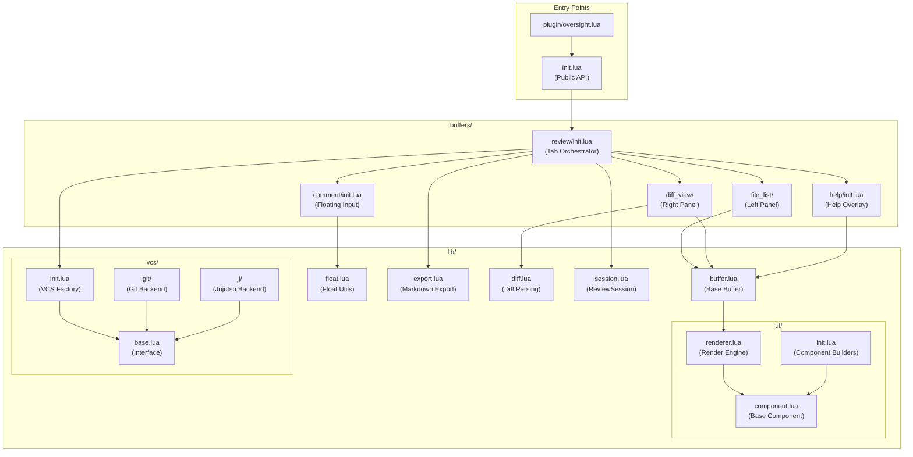
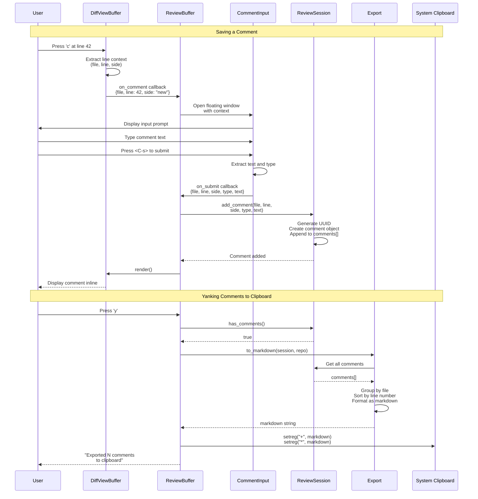

# Architecture Diagrams

## Package Structure

```mermaid
graph TB
    subgraph Entry["Entry Points"]
        init["init.lua<br/>(Public API)"]
        plugin["plugin/oversight.lua"]
    end

    subgraph Buffers["buffers/"]
        review["review/init.lua<br/>(Tab Orchestrator)"]
        file_list["file_list/<br/>(Left Panel)"]
        diff_view["diff_view/<br/>(Right Panel)"]
        comment["comment/init.lua<br/>(Floating Input)"]
        help["help/init.lua<br/>(Help Overlay)"]
    end

    subgraph Lib["lib/"]
        buffer["buffer.lua<br/>(Base Buffer)"]
        float["float.lua<br/>(Float Utils)"]
        export["export.lua<br/>(Markdown Export)"]
        diff["diff.lua<br/>(Diff Parsing)"]

        subgraph UI["ui/"]
            ui_init["init.lua<br/>(Component Builders)"]
            component["component.lua<br/>(Base Component)"]
            renderer["renderer.lua<br/>(Render Engine)"]
        end

        session["session.lua<br/>(ReviewSession)"]

        subgraph VCS["vcs/"]
            vcs_init["init.lua<br/>(VCS Factory)"]
            vcs_base["base.lua<br/>(Interface)"]
            git["git/<br/>(Git Backend)"]
            jj["jj/<br/>(Jujutsu Backend)"]
        end
    end

    %% Entry point relationships
    plugin --> init
    init --> review

    %% Review orchestrates panels
    review --> file_list
    review --> diff_view
    review --> comment
    review --> help

    %% Buffers inherit from base
    file_list --> buffer
    diff_view --> buffer
    comment --> float
    help --> buffer

    %% Buffer uses UI system
    buffer --> renderer
    renderer --> component
    ui_init --> component

    %% Review uses session and VCS
    review --> session
    review --> export
    review --> vcs_init

    %% VCS hierarchy
    vcs_init --> vcs_base
    git --> vcs_base
    jj --> vcs_base

    %% Diff parsing used by diff_view
    diff_view --> diff
```

## Comment Save and Export Flow

```mermaid
sequenceDiagram
    participant User
    participant DiffView as DiffViewBuffer
    participant Review as ReviewBuffer
    participant CommentInput
    participant Session as ReviewSession
    participant Export
    participant Clipboard as System Clipboard

    Note over User,Clipboard: Saving a Comment

    User->>DiffView: Press 'c' at line 42
    DiffView->>DiffView: Extract line context<br/>(file, line, side)
    DiffView->>Review: on_comment callback<br/>{file, line: 42, side: "new"}
    Review->>CommentInput: Open floating window<br/>with context
    CommentInput->>User: Display input prompt
    User->>CommentInput: Type comment text
    User->>CommentInput: Press <C-s> to submit
    CommentInput->>CommentInput: Extract text and type
    CommentInput->>Review: on_submit callback<br/>{file, line, side, type, text}
    Review->>Session: add_comment(file, line,<br/>side, type, text)
    Session->>Session: Generate UUID<br/>Create comment object<br/>Append to comments[]
    Session-->>Review: Comment added
    Review->>DiffView: render()
    DiffView-->>User: Display comment inline

    Note over User,Clipboard: Yanking Comments to Clipboard

    User->>Review: Press 'y'
    Review->>Session: has_comments()
    Session-->>Review: true
    Review->>Export: to_markdown(session, repo)
    Export->>Session: Get all comments
    Session-->>Export: comments[]
    Export->>Export: Group by file<br/>Sort by line number<br/>Format as markdown
    Export-->>Review: markdown string
    Review->>Clipboard: setreg("+", markdown)<br/>setreg("*", markdown)
    Review-->>User: "Exported N comments<br/>to clipboard"
```
