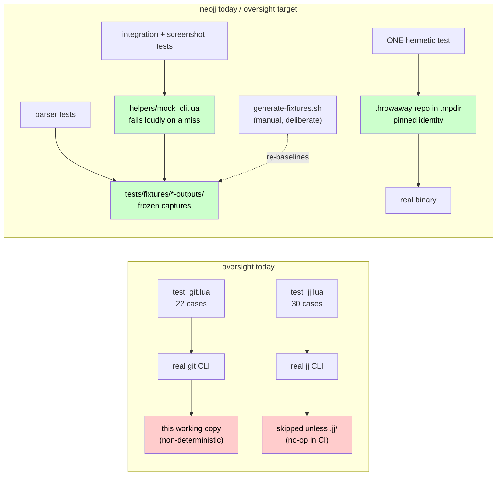
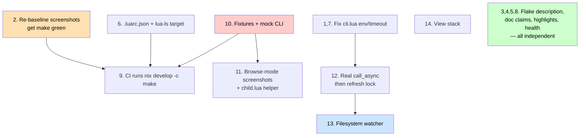

# What oversight-nvim Can Learn From neojj

Date: 2026-08-03. Compared against `../neojj/` at its current working copy.

Both plugins share DNA: the same `lib/buffer.lua` + `lib/ui/{component,renderer}`
pattern, the same fluent CLI builder, mini.test, LuaCATS. neojj is ~9.8k lines of
Lua to oversight's ~6.6k, and roughly 7.0k lines of tests to oversight's 2.9k.
The gap is not architecture — it is the *hardening* layer: what happens when the
subprocess is slow, missing, or misconfigured; what the test suite does when it
can't reach a real repo; and what CI actually enforces.

An older document, `../neojj-oversight-analysis.md` (Jan 2026), covered the
same ground at a high level. This one is grounded in verified behaviour: every
defect in section 1 was reproduced, not inferred.

---

## 1. Defects neojj already fixed that we still have

### 1.1 Every VCS command runs with an empty environment (`lib/cli.lua`)

`Cli.new()` sets `builder.env = {}`, and `call()` unconditionally passes
`env = self.env` to `plenary.Job`. plenary treats *any* non-nil env table as the
**complete** child environment (`job.lua:116-129`, `job.lua:274-275`), and an
empty Lua table is truthy. Verified:

```
$ nvim --headless -u scripts/minimal_init.lua \
    -c "lua print(require('oversight.lib.cli').new('sh')
        :arg('-c'):arg('echo HOME=\$HOME'):call().stdout)"
""                       # oversight: empty
{ "HOME=/Users/krisjenkins" }   # plenary with env unset: inherited
```

So every `git` and `jj` call we make runs with no `HOME`, no `PATH`, no
`SSH_AUTH_SOCK`, no `GIT_*`, no `JJ_CONFIG`. It has not bitten us yet only
because we resolve the binary to an absolute path first and only run local
read-only commands. But it means git silently ignores `~/.gitconfig` — so
`core.quotepath`, `diff.*`, `include.path` and conditional includes all behave
differently inside oversight than in the user's terminal, and jj ignores
`~/.config/jj/config.toml`.

neojj's fix, with the reasoning recorded in-line (`lib/jj/cli.lua`):

```lua
-- plenary's Job treats any non-nil env table as the *entire* child
-- environment, so an empty-but-non-nil table would strip PATH,
-- SSH_AUTH_SOCK, JJ_CONFIG, EDITOR, etc. Passing nil lets the child
-- inherit ours.
env = next(self._env) and self._env or nil,
```

**Fix:** one line, plus a test asserting `HOME` survives a `Cli` call.

### 1.2 Five-second timeout on every VCS call, reported as a stack trace

We call `job:sync()` with no argument. plenary defaults `Job:wait` to 5000ms
(`job.lua:474`) and then raises. Our `pcall` turns that into
`{ success = false, exit_code = -1, stderr = <plenary stack trace> }` with no
`vim.notify`, so on a large repo a slow `git diff` looks to the user like an
empty diff.

neojj uses `SYNC_TIMEOUT_MS = 60000`, and distinguishes a timeout from a spawn
failure when notifying:

```lua
if err:match("unable to complete") then
    vim.notify("NeoJJ: jj command timed out after " .. SYNC_TIMEOUT_MS .. "ms", WARN)
else
    vim.notify("NeoJJ: failed to run jj: " .. err, ERROR)
end
```

### 1.3 `Cli:call_async()` is not asynchronous

Ours wraps the *synchronous* `self:call()` inside `async.wrap`, so it blocks the
UI exactly as `call()` does. Nothing calls it today, which makes it a trap rather
than a live bug — the next person to reach for it gets no benefit and no warning.

neojj's is genuinely async: `Job:add_on_exit_callback(vim.schedule_wrap(...))`,
a one-shot `uv` timer for the timeout, and a `finished` guard so the coroutine is
resumed exactly once. Worth porting wholesale if we go async (see §4.1);
otherwise delete ours rather than leave the trap.

### 1.4 Missing-binary handling

We fall back to the bare command name when `exepath` returns `""`, and
`Job:new` then raises `Executable not found` with a traceback that we surface as
`stderr`. neojj resolves upfront and returns a clean failure table plus a
`vim.notify`. Same shape as 1.2 — the point is that infrastructure failures
should never reach a render path as a stack trace.

### 1.5 `make` is currently red on `main`

Four screenshot tests fail:

```
Different `text` cell at line 29 column 19. Reference: "R". Observed: "-".
```

Column 19 of line 29 is inside the statusline's `[RO]` flag — the buffers became
`nomodifiable` (`[-]`) rather than `readonly` (`[RO]`), presumably from the
"buffers shouldn't be editable" TODO item. The references just need
re-baselining. That this went unnoticed is the real finding: see §2.

### 1.6 Dead module reference

`lua/oversight/lib/storage/init.lua` requires `oversight.lib.storage.json`,
which does not exist. Nothing calls `M.json()`, so it never raises. Delete the
accessor or the file.

### 1.7 Documentation asserts a feature we removed

README lists "**Session persistence** — Comments and review state survive editor
restarts", and `CLAUDE.md` says "Session auto-saves to JSON on changes". Neither
is true: `Session.load_or_create` is `return Session.new(...)` and `Session:save`
is a documented no-op. `health.lua` also reports on a `stdpath("data")/oversight`
directory that will now never be created. Either restore persistence or correct
all four places.

### 1.8 `flake.nix` description is `"NeoJJ - Neovim plugin for Jujutsu VCS"`

Copy-paste leftover.

---

## 2. Build and CI

### 2.1 We are not type-checking at all

`TODO.md` records "Add lua-language-server type checking to Makefile" as done. It
isn't: `make typecheck` runs only luacheck, which is a linter and ignores LuaCATS
annotations entirely. Worse, our config lives in `.luarc.lua` — **lua_ls only
reads `.luarc.json`**, so that file has never had any effect. The flake already
ships `lua-language-server`.

Port neojj's target verbatim, including its two hard-won comments:

```make
typecheck: luacheck lua-ls

luacheck:
	@luacheck lua scripts tests

# lua_ls treats the --check path as the workspace root, so it will not discover
# the repo-root .luarc.json on its own — point it there with an absolute path
# (a bare/relative path resolves against lua/ and is silently ignored, leaving
# vim et al. undefined and flooding the run with false positives).
lua-ls:
	@lua-language-server --check=lua --checklevel=Warning --configpath=$(CURDIR)/.luarc.json
```

When converting `.luarc.lua` → `.luarc.json`, take neojj's two `disable` entries
and the reasons for them:

- `codestyle-check` — otherwise lua_ls's formatter fights stylua. (Our current
  `.luarc.lua` explicitly *enables* it under `neededFileStatus`.)
- `deprecated` — Neovim's LuaJIT has no 5.2 compat, so we use the global
  `unpack`, which lua_ls's 5.4 meta flags as deprecated.

Expect this to surface a batch of real findings on first run.

### 2.2 CI is weaker than the dev shell

Ours installs Neovim via an action and luacheck via apt+luarocks. That means CI
runs a *different* toolchain from `nix develop`, never installs stylua (so
formatting is unchecked), never installs jj (so every jj test skips — already
flagged in `docs/test-suite-review.md`), and can't run lua_ls.

neojj's `ci.yml` runs `nix develop -c make` and `nix develop -c make check-format`
against the same flake developers use. It also carries three things worth taking:

- **`concurrency: { group: ci-${{ github.ref }}, cancel-in-progress: true }`** —
  stops a burst of pushes queueing long builds.
- **Nix store caching via `nix-community/cache-nix-action`**, with the comment
  explaining why it must be paired with `nixbuild/nix-quick-install-action`
  (single-user store) rather than the Determinate installer — the cache untars
  into `/nix` as the runner user, which a daemon install forbids, and the failure
  mode is a silent rebuild from source. Our flake has the same jujutsu overlay,
  so we would hit the same source build.
- **`deps` cached on `hashFiles('Makefile')`**, skipping the mini/plenary clone.

There is a `nix-ci-cache` skill that covers this recipe.

### 2.3 Add `make check-format` and a release workflow

We have `make format` but nothing that fails on unformatted code. neojj has
`check-format` (`stylua --check`) wired into CI, and a `release.yml` that cuts a
GitHub release with generated notes on any `v*` tag push. Both are small and
worth copying. (Conversely: our Makefile has `.PHONY` and a `clean` target and
neojj's doesn't — keep those.)

---

## 3. Test suite

Our own `docs/test-suite-review.md` already diagnosed the two biggest problems:
`test_git.lua` shells out to real git against *this* repo, and `test_jj.lua`
early-returns unless `.jj/` exists, so ~30 test cases are no-ops in CI. neojj
solved exactly this.

Where the test suites reach for their data today, and where ours should:



The pieces to port:

### 3.1 Frozen output fixtures

`tests/fixtures/jj-outputs/` holds 45 committed captures of real `jj` output
(`initial-status.txt`, `status-renames.txt`, `conflict-state-log.json`, …),
generated by a `create-demo-repo.sh` + `generate-fixtures.sh` pair. Parsers and
screenshots assert against their exact bytes.

The discipline around them matters as much as the files (from `tests/CLAUDE.md`):

- fixtures are **canonical and frozen**, captured with a **pinned tool version**
  (jj 0.43.0), and regenerating the demo repo **re-baselines everything**,
  because jj change IDs are random — "do it deliberately, not casually";
- the disposable `fixtures/demo-repo/` that generates them is git-ignored;
- hand-authored edge-case fixtures (e.g. `dotfile-test-status.txt`) are labelled
  as such so nobody regenerates them away.

For us that means `tests/fixtures/git-outputs/` and `tests/fixtures/jj-outputs/`
covering: `--name-status` with M/A/D/R/C, rename paths in both git's
`old\tnew` and jj's `{a => b}` brace form, unified diffs with pure additions /
pure deletions / multiple hunks / no trailing newline, and an empty working copy.
Then `expand_rename_path` gets tested with fixed inputs instead of hunting for
"the rename of diff.lua" in our own history.

### 3.2 A fixture-backed mock CLI

`tests/helpers/mock_cli.lua` (278 lines) is a drop-in for the CLI builder,
installed via `package.loaded['neojj.lib.jj.cli'] = MockCli.create_mock_module()`.
It implements the full fluent interface, routes `(command, args, state)` to a
fixture filename, and can simulate command failures via `MockCli.set_failure`.

The design decision worth copying is the miss path — it fails **loudly**:

```lua
-- No fixture matched: fail LOUDLY so drift surfaces instead of being
-- masked by a silent empty-success result. We prefer `success = false`
-- + a descriptive stderr over a raw error() because call() runs inside
-- plenary async jobs and the plugin's pcall/failure paths, where a bare
-- error() may be swallowed...
```

We have it easier: git and jj share `lib/cli.lua`, so one mock at that level
covers both backends.

### 3.3 One hermetic end-to-end test, not many semi-hermetic ones

neojj's `test_unit.lua` builds a throwaway jj repo in a temp dir with
`JJ_USER`/`JJ_EMAIL` pinned, runs the real binary against it, and asserts on
change IDs and modified files. That is the right shape: everything else uses
fixtures, and exactly one test proves the fixtures still describe reality. Our
current approach — running real git against the repo under test — is
non-deterministic by construction.

### 3.4 Shared child-Neovim scaffolding

`tests/helpers/child.lua` packages the `restart` + `readonly` + plenary-rtp +
`expect` global boilerplate behind `local child, new_set = require("tests.helpers.child")()`,
with `pre_case` extras *appended* to the standard block rather than replacing it.
We only have one child-neovim file today (`test_diff_view_screenshot.lua`), so
this is worth doing at the point we add the second — which §3.5 implies we
should.

### 3.5 Screenshot coverage for browse mode

We have four screenshot tests, all of `diff_view`. Browse mode — `file_tree`
(600 lines, our largest module) and `file_view` (457) — has none. neojj has 11,
including eight at the *workflow* level (`test_workflow_log_to_commit_navigation`,
`test_workflow_commit_file_interactions`), which catch layout regressions that
line-content assertions miss. Re-baseline the four stale references (§1.5) and
extend to browse.

### 3.6 A `tests/CLAUDE.md`

neojj's is not boilerplate; it is a log of things that cost someone an afternoon:

- a `nofile` buffer **refuses `:w` and never fires `BufWriteCmd`** — a
  write-to-submit buffer must be `acwrite`;
- drive `:q`/`:wq` in a child only when the buffer is **not the last window**, or
  the child Neovim exits and the test hangs;
- `for _, v in ipairs({...})` **silently truncates at the first nil**, which
  bites constantly in debug logging (`log("ok:", ok, "err:", err)`);
- when to reach for `package.loaded` mocking vs. direct function replacement.

We should keep the equivalent file for our own gotchas rather than the generic
"here is how mini.test works" content.

---

## 4. Architecture

Ordered by value to *our* use case, which is different from neojj's: we are
watching an AI agent edit files underneath a review.

### 4.1 Async CLI, then a refresh lock

Everything in oversight blocks the UI. The order matters: port neojj's real
`call_async` (§1.3) first, then adopt `JjRepo`'s `refresh_lock =
async.control.Semaphore.new(1)` so concurrent refreshes serialise instead of
interleaving. The semaphore is pointless while the calls are synchronous.

neojj's `JjRepo:refresh` is also worth reading for its error propagation: it
returns `(boolean, string?)` so the buffer can render a failure banner rather
than silently showing stale state — and it releases the permit before inspecting
the pcall result, so a raising module can't deadlock the lock.

### 4.2 A filesystem watcher — the highest-value feature to steal

`lib/watcher.lua` (281 lines) auto-refreshes every open view when the repo
changes externally. For a plugin whose entire premise is "review what the agent
just wrote", this is more valuable to us than it is to neojj. Its comments encode
failure modes we would otherwise rediscover:

- **macOS prefers `fs_poll` over `fs_event`.** kqueue/FSEvents silently stops
  delivering once the watched directory's entries are replaced — and every jj
  operation deletes and recreates the op-head file, so that failure is
  *guaranteed*. Git's `.git/index` is rewritten the same way.
- **Never parse the event filename** — `fs_event` gives no reliable "renamed-to"
  name across platforms. Any event means "go re-query".
- **150ms debounce**, because one logical operation touches several files.
- The libuv callback runs on the loop where **Neovim API calls are illegal**;
  only `vim.schedule_wrap` hops back.
- `recursive = false`, VimLeavePre cleanup registered once, refcounted
  `M.cleanup(root)` when the last view for a root detaches.

Our watch targets would be `.git/index` + `.git/HEAD` + `.git/refs` for git and
`.jj/repo/op_heads/heads` for jj — but for us the *working tree* matters more
than the repo dir, since the agent's edits are uncommitted. That is a genuine
design difference, not a straight port.

### 4.3 Highlights should follow the colorscheme

`lua/oversight/highlights.lua` hardcodes 14 hex colours (a One Dark palette).
neojj's has **zero** — every group links to a standard one (`DiffAdd`,
`DiffChange`, `Comment`, `Special`, `Title`). Ours looks wrong on any light
theme. Straight mechanical port, one of the cheapest wins here.

### 4.4 Health check

Ours calls `vim.health.start` directly — that name is Neovim 0.10+, while the
same file's first check asserts we support 0.9.0. neojj feature-detects:

```lua
local h = { start = health.start or health.report_start, ok = health.ok or health.report_ok, ... }
```

It also reports discovered *versions* (`jj 0.43.0 (/path)`) against declared
minimums, and checks that `plenary.async` and `plenary.job` actually load. We
depend on plenary and don't check for it, but we do check for a data directory
we never create (§1.7).

### 4.5 View stack

`lib/view_stack.lua` keeps drilled-into views as **live buffers** (`bufhidden =
"hide"`) in one shared window, so Vim preserves cursor/fold/scroll for free
instead of snapshot-and-restore. `q`/`<esc>` pops a frame; the no-arg command
raises the stack from anywhere. We already open files from the diff view, so `q`
currently has no consistent meaning — this would give it one. The accompanying
rule is good practice too: **when adding a buffer type, decide explicitly whether
it is a stack frame or a transient editor.**

### 4.6 Repository module registration

`repo:register_module(name, module)` with a generic `refresh()` fan-out. Worth
having once we have more than one refreshable state source. Lower priority than
the above; noted so it isn't lost.

### 4.7 Not applicable

`lib/ui/span_emitter.lua` solves positional highlighting of column-aligned jj log
rows. We render diffs and trees, not aligned records. Skip.

---

## 5. Documentation and release

- **CI badge + demo GIF in the README.** neojj's demo is a
  [VHS](https://github.com/charmbracelet/vhs) tape (`scripts/record-demo.tape`)
  with the environment prep split into `record-demo-setup.sh`, so the tape stays
  a readable list of keystrokes. It is reproducible and diffable, unlike a
  hand-recorded GIF. Note its recorded gotcha: forcing semicolon-form truecolor
  via a custom terminfo, because VHS's default mangles the blue channel in TUIs.
  There is a `vhs` skill covering this.
- **Document the `:helptags doc/` regeneration step** in CLAUDE.md. We track
  `doc/tags` but never say how to rebuild it.
- **Name a source of truth for keybindings.** neojj's CLAUDE.md says outright:
  "`StatusBuffer:_setup_mappings()` is the source of truth. The user-facing
  tables in README.md and doc/neojj.txt must match too." We have keybindings in
  four places with no such statement.

---

## 6. Suggested order

Cheap and unambiguous first; the fixture work is the big one. Most items are
independent, but a few genuinely unblock others:



Item 2 is a prerequisite for CI in a practical sense, not a technical one: there
is no point enforcing a pipeline that is already failing.

### Progress

Items 1–4 are done (`make` is green at 126 cases). Two things turned up while
doing them that were not in the original survey:

- Writing the regression test for §1.1 exposed that the `env` **and** `args`
  instance fields shadowed the same-named methods on the `Cli` metatable, so
  `builder:env(k, v)` and `builder:args(t)` had never been callable — they
  raised "attempt to call method (a table value)". The env field is now `_env`;
  the uncallable, uncalled `args()` method was removed.
- `lib/storage/init.lua` was not merely half-broken, it was entirely unused —
  nothing requires `oversight.lib.storage`, and Lua resolves
  `oversight.lib.storage.session` without an `init.lua`. The whole file went.
- The persistence cleanup reached further than README/CLAUDE.md/health: the
  vimdoc documented a `data_dir` **setup option**, and `OversightConfig` carried
  a matching `@field` that nothing read. `setup()` now honestly takes no options.

Items 5, 6 and 9 are also done. Item 6 turned out to be the productive one:
lua_ls's first run found 30 problems in 8 files, three of them real bugs rather
than annotation gaps.

- `VcsBackend` declared only *data* fields, so every `repo:get_root()`,
  `get_changed_files()`, `get_file_diff_raw()` and friend was an undefined field
  — 23 of the 30. `base.lua` already documented the contract in prose; it is now
  written on the class.
- `LineInfo` was never extended when browse mode landed, so the file viewer's
  `line_no` was undeclared.
- `ReviewBuffer:is_valid()` and `BrowseBuffer:is_valid()` are annotated
  `@return boolean` but returned the last operand of an `and` chain — a buffer
  object. Worth noting the near-miss in the fix: `~= nil` looks like the obvious
  coercion and is wrong, because `nvim_tabpage_is_valid` returns `false` and
  `false ~= nil` would report a **closed tab as valid**. `not not` is correct.

Item 9 was pulled forward because item 6 forced it: `make typecheck` now needs
lua-language-server, which has no apt package, so the old apt/luarocks workflow
could no longer run the build at all.

Items 7 and 8 are done too, and item 7 needs a correction to §1.2 above: the
claim that a timeout arrived "with no `vim.notify`" was wrong. `logger.error`
already routes to `vim.notify` (see `logger.lua`), so the user *was* notified —
with plenary's raw stack trace, which is worse than useless. The fix was
therefore to phrase the failures for a human and route them through the logger
at the right level (WARN for a timeout, ERROR for a spawn failure), **not** to
add a `vim.notify`, which would have notified twice. Discovered by a test
asserting one notification and getting two.

Two judgement calls worth recording:

- The timeout regression test sleeps 6s — just past plenary's old 5s default.
  It is the only way to genuinely prove the timeout was raised, but it makes
  `make test` noticeably slower. Worth revisiting if the suite gets slow.
- Item 8 deliberately asserts **no** minimum git or jj version. neojj declares
  `MIN_JJ`, but we use only long-stable git subcommands and a jj floor would be
  a guess — inventing one would repeat exactly the unfounded-claim problem item
  4 cleaned up. The versions are reported as diagnostics instead.

Item 10 is done, and it paid for itself before a single test was rewritten.
Building the fixture generator — running the plugin's exact commands against a
purpose-built demo repository and reading the output — turned up **two real
bugs**, neither of which any existing test could have caught, because the
existing tests ran against this working copy on a machine configured to hide
one of them.

- **`jj diff` was never asked for a format we can parse.** jj's default diff
  format is `color-words`, not unified. `JjBackend:get_file_diff_raw` fed that
  straight to `Diff.parse_unified_diff`, which finds no `@@` headers and returns
  zero hunks — so **every file in a jj repository rendered as an empty diff**.
  It worked here only because this machine's personal jj config sets
  `ui.diff-formatter = ":git"`. `jj.diff()` now passes `--git` explicitly.
  Note the interaction with item 1: the empty-`env` bug would have *masked* this
  one, by denying the child process the very config that was hiding it.
- **git rename paths were split on whitespace, not tabs.** `--name-status` is
  TAB-separated, but the rename branch matched `"^(.+)%s+(.+)$"`. Given
  `R100\tdocs/old name.md\tdocs/new name.md` that splits at the last *space* and
  yields `old_path = "docs/old name.md\tdocs/new"`, `path = "name.md"` — any
  renamed file whose name contains a space. Now split on tabs, which also gets
  `C` (copy) statuses their source path for free.

Three judgement calls:

- **Not every status can be captured honestly.** git only emits `C` when asked
  with `--find-copies-harder`, which the plugin does not pass, so no genuine
  capture can contain one. Rather than fabricate a "capture", the `C` and
  paths-with-spaces cases are hand-authored fixtures, labelled as such in
  `tests/fixtures/README.md` so a regeneration does not quietly delete them.
- **Scalar outputs are canned in the mock's route table, not frozen as
  fixtures.** Freezing `git rev-parse --show-toplevel` would bake a `/tmp/...`
  path from whoever last ran the generator into a committed file. Fixtures are
  for the multi-line output the parsers actually work on.
- **The demo repository's git changes are staged.** `git diff HEAD` — the
  command the backend runs — only reports added and renamed files once they are
  in the index, so an unstaged capture would silently lose the `A` and `R`
  cases. Which raises a real product question, noted here and not acted on: an
  *untracked* new file never appears in review mode at all, and a brand-new file
  is exactly what an AI agent tends to produce.

§3.6's `tests/CLAUDE.md` landed with this item rather than as a numbered entry
of its own — the traps it records (the upvalue that makes `package.loaded`
mocking insufficient, never skipping by returning early, neutralising the
developer's own VCS config) are all ones this work hit.

| # | Change | Effort | Why |
|---|--------|--------|-----|
| ~~1~~ | ~~`env = next(self._env) and self._env or nil`~~ **done** | trivial | §1.1, real correctness bug |
| ~~2~~ | ~~Re-baseline 4 screenshots; get `make` green~~ **done** | trivial | §1.5, nothing else is trustworthy until then |
| ~~3~~ | ~~Fix flake description, delete dead `storage/init.lua`~~ **done** | trivial | §1.6, §1.8 |
| ~~4~~ | ~~Correct the persistence claims in README/CLAUDE.md/health~~ **done** | trivial | §1.7 |
| ~~5~~ | ~~Link highlights to colorscheme groups~~ **done** | small | §4.3, visible to every user |
| ~~6~~ | ~~`.luarc.lua` → `.luarc.json`, add `lua-ls` target~~ **done** | small | §2.1, we type-check nothing today |
| ~~7~~ | ~~60s timeout + notify + missing-binary handling in `lib/cli.lua`~~ **done** | small | §1.2, §1.4 |
| ~~8~~ | ~~Health: `report_*` fallback, versions~~ **done** | small | §4.4 |
| ~~9~~ | ~~CI → `nix develop -c make` + store cache + `check-format`~~ **done** | medium | §2.2, §2.3 |
| ~~10~~ | ~~Fixtures + mock CLI; de-fang `test_git.lua` / `test_jj.lua`~~ **done** | large | §3.1–3.3, biggest test-quality win |
| 11 | Screenshot coverage for browse mode; `tests/helpers/child.lua` | medium | §3.4, §3.5 |
| 12 | Real `call_async`, then repository refresh lock | medium | §4.1 |
| 13 | Filesystem watcher for the working tree | medium | §4.2, best new feature for our use case |
| 14 | View stack | large | §4.5 |
| 15 | VHS demo, CI badge, release.yml, keybinding source-of-truth note | medium | §2.3, §5 |
