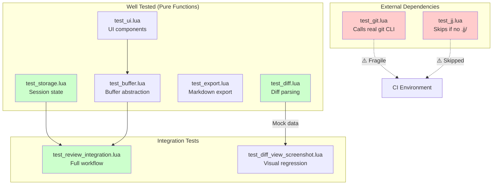

# Test Suite Review: oversight-nvim

## Overview

The test suite uses `mini.test` with 9 test files covering core abstractions, git/jj VCS operations, session storage, UI components, and integration workflows. The overall quality is good, with several well-designed patterns, but there are some areas worth flagging.

---

## Tests Relying on External Services

### `test_git.lua` - Lines 101-213

Several tests execute actual git commands against the real repository:

```lua
T["Git CLI"]["call() executes and returns result"] = function()
    local result = git.rev_parse():flag("git-dir"):call()  -- Executes real git
    ...
end
```

The Git Repository tests (`instance()`, `get_root()`, `get_head()`, `get_branch()`, `get_changed_files()`) all call the real git CLI. These tests will fail or behave unpredictably if:

- Run outside a git repo
- The git state changes between runs
- On a system without git

**Recommendation**: The CLI _builder_ tests are fine (they just construct command strings). The tests that actually call `.call()` should either:

1. Mock the system command execution
2. Use captured canonical git output fixtures

### `test_jj.lua` - Lines 94-279

These tests have a conditional pattern that skips if not in a jj repo:

```lua
if vim.fn.isdirectory(cwd .. "/.jj") ~= 1 then
    return  -- Skip test
end
```

**Problem**: This means the tests are effectively NOPs in most CI environments. The rename path expansion tests (lines 175-205) specifically test for files that may or may not exist:

```lua
-- Look for the specific rename of diff.lua
for _, file in ipairs(files) do
    if file.status == "R" and file.path:match("diff%.lua$") then
        -- This depends on current repo state
    end
end
```

**Recommendation**: The `expand_rename_path` function is pure and testable - extract it and test with fixed inputs rather than relying on actual jj repo state. Example canonical inputs:

- `"path/to/{old => new}/file.lua"` → old: `"path/to/old/file.lua"`, new: `"path/to/new/file.lua"`
- `"lua/oversight/lib/{git => }/diff.lua"` → old: `"lua/oversight/lib/git/diff.lua"`, new: `"lua/oversight/lib/diff.lua"`

---

## Well-Designed Tests

### `test_diff.lua` - Excellent

This is the best test file in the suite. It tests the pure diff parsing logic with hardcoded inputs:

```lua
local diff_lines = {
    "@@ -1,3 +1,4 @@",
    " unchanged",
    "-removed",
    "+added",
    ...
}
local hunks = Diff.parse_unified_diff(diff_lines)
```

No external dependencies. Deterministic. Tests edge cases (only additions, only deletions, multiple hunks).

### `test_storage.lua` - Good

Pure unit tests of session state management. Uses in-memory sessions without file I/O. Covers the important scenarios including the newer `reset_file` and `ensure_file` with diff hash detection.

### `test_export.lua` - Good

Uses a mock repository (`create_mock_repo()`) rather than real git. Tests the markdown generation logic in isolation.

### `test_review_integration.lua` - Excellent Design

The integration tests properly use mocks:

```lua
function helpers.create_mock_repo(opts)
    return {
        get_root = function() return root end,
        get_branch = function() return opts.branch or "main" end,
        ...
    }
end
```

The test file avoids real git operations by:

1. Injecting mock repos
2. Setting `diff_view.current_file` directly instead of calling `show_file()`
3. Silencing `vim.notify` during tests

This is the right approach for integration tests.

### `test_diff_view_screenshot.lua` - Clever

Uses child Neovim processes with hardcoded mock diff data for visual regression testing. This captures real rendering without git dependencies.

---

## Missing Test Coverage for Complex Code

### `lib/storage/session.lua` - `compute_hash()` (lines 91-97)

The djb2 hash function is simple but used for critical change detection. It's not directly tested.

### `lib/storage/session.lua` - `generate_uuid()` (lines 72-79)

UUID generation isn't tested (randomness is hard to test, but format validation could be done).

### `lib/ui/renderer.lua` - Not tested

The renderer transforms component trees to buffer lines with highlights. This is complex logic with no direct tests - it's only tested transitively through `test_buffer.lua`.

### `lib/vcs/init.lua` - VCS detection logic

The VCS auto-detection (checking for `.jj/` vs `.git/`) isn't directly tested beyond the jj-conditional tests.

---

## Test Architecture



---

## Suggestions

### 1. Create git output fixtures

Instead of calling real git, capture canonical outputs:

```lua
local fixture = [[
@@ -1,3 +1,4 @@
 unchanged
-removed
+added
]]
local result = { success = true, stdout = fixture, stderr = "", exit_code = 0 }
```

### 2. The renderer could benefit from direct tests

Given its complexity in mapping component trees to highlight groups, direct tests would catch regressions better than relying on buffer content assertions.

---

## Summary

| Aspect                        | Assessment                                                  |
| ----------------------------- | ----------------------------------------------------------- |
| **External service reliance** | Git tests call real CLI; jj tests skip in most environments |
| **Value-focused testing**     | Good - complex diff parsing well tested                     |
| **Coverage gaps**             | renderer, VCS detection, hash/uuid helpers                  |
| **Overall quality**           | Good - mocking patterns in integration tests are exemplary  |

The test suite's strongest parts are the pure function tests (`test_diff.lua`) and the well-mocked integration tests (`test_review_integration.lua`). The weakest parts are the VCS tests that either call real external tools or skip entirely.
